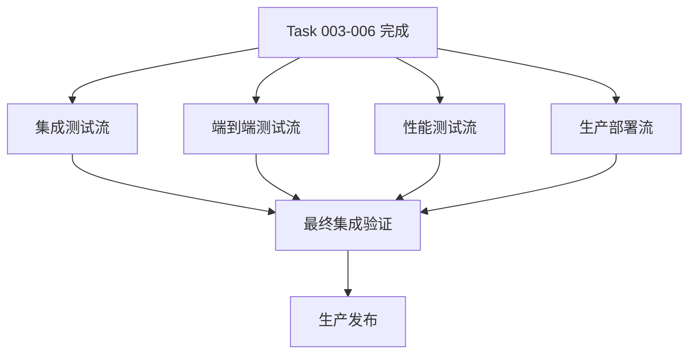

# Issue #17 Integration & Testing - 并行工作流分析

## 概述

Issue #17 是 loginAndLogout epic 的最终集成任务，需要完成前后端认证系统的全面集成、测试、优化和生产部署准备。本分析识别了可以并行执行的工作流，以优化开发效率。

## 并行工作流架构



## 工作流详细分析

### 1. 集成测试流 (Integration Testing Workflow)

**范围**: 前后端 API 集成和路由守卫实现

**核心任务**:
- 前后端 API 完整集成
- JWT token 生命周期管理
- 路由守卫实现
- 自动 token 刷新机制

**涉及文件**:
```
新建:
- src/router/guards/auth.ts (路由守卫核心逻辑)
- tests/integration/api-integration.spec.ts (API 集成测试)
- tests/integration/auth-guards.spec.ts (路由守卫测试)

修改:
- src/router/index.ts (注册路由守卫)
- src/plugins/axios.ts (完善错误处理和重试逻辑)
- src/stores/auth.ts (添加 token 刷新逻辑)
```

**依赖关系**:
- **前置依赖**: Task 003 (Authentication API), Task 005 (Frontend Authentication System)
- **并行条件**: 可与其他工作流同时进行
- **后续阻塞**: 必须在最终集成验证前完成

**代理类型建议**: **Full-Stack Integration Agent**
- 需要深度理解前后端认证流程
- 具备 Vue Router 和 JWT 处理经验
- 能够编写综合性集成测试

**工作量估计**: 4-5 小时

---

### 2. 端到端测试流 (E2E Testing Workflow)

**范围**: 完整用户流程的端到端测试开发

**核心任务**:
- 完整登录退出流程 E2E 测试
- 账户锁定场景测试
- Token 过期处理测试
- 多浏览器兼容性测试

**涉及文件**:
```
新建:
- tests/e2e/auth.spec.ts (主要 E2E 测试套件)
- tests/e2e/helpers/auth-helpers.ts (测试辅助函数)
- tests/e2e/config/playwright.config.ts (Playwright 配置)
- tests/e2e/fixtures/test-users.json (测试用户数据)

修改:
- package.json (添加 E2E 测试脚本)
- .gitignore (排除测试生成的临时文件)
```

**依赖关系**:
- **前置依赖**: Task 005 (Frontend Authentication System), Task 006 (User Experience)
- **并行条件**: 可与集成测试流、性能测试流并行
- **后续阻塞**: 必须在生产发布前完成

**代理类型建议**: **E2E Testing Specialist Agent**
- 精通 Playwright/Cypress 测试框架
- 具备用户体验测试经验
- 能够设计全面的测试场景覆盖

**工作量估计**: 5-6 小时

---

### 3. 性能测试流 (Performance Testing Workflow)

**范围**: 性能基准测试、负载测试和优化

**核心任务**:
- 登录 API 性能基准测试
- 前端组件渲染性能测试
- 内存泄漏检测
- 并发登录负载测试

**涉及文件**:
```
新建:
- tests/performance/auth-load.spec.ts (负载测试)
- tests/performance/api-benchmark.spec.ts (API 性能测试)
- tests/performance/memory-leak.spec.ts (内存泄漏测试)
- scripts/performance-monitor.js (性能监控脚本)
- performance/k6-load-test.js (K6 负载测试脚本)

修改:
- package.json (添加性能测试脚本)
- vite.config.ts (性能监控配置)
```

**依赖关系**:
- **前置依赖**: Task 003 (Authentication API), Task 004 (Security Enhancements)
- **并行条件**: 可与其他测试流完全并行
- **后续阻塞**: 性能优化结果可能影响最终部署配置

**代理类型建议**: **Performance Testing Agent**
- 精通性能测试工具 (K6, Lighthouse, Jest Performance)
- 具备前后端性能优化经验
- 能够解读性能指标并提供优化建议

**工作量估计**: 3-4 小时

---

### 4. 生产部署流 (Production Deployment Workflow)

**范围**: 生产环境配置、Docker 优化和监控设置

**核心任务**:
- 环境变量配置管理
- Docker 容器优化
- 安全头配置 (HTTPS, HSTS, CSP)
- 健康检查端点
- 错误日志和监控配置

**涉及文件**:
```
新建:
- docker/Dockerfile.prod (生产环境 Dockerfile)
- scripts/deploy.sh (部署脚本)
- monitoring/health-check.ts (健康检查端点)
- config/security-headers.js (安全头配置)
- docker/nginx.prod.conf (生产 Nginx 配置)

修改:
- docker-compose.prod.yml (生产环境编排)
- .env.production (生产环境变量)
- package.json (生产构建脚本)
```

**依赖关系**:
- **前置依赖**: Task 004 (Security Enhancements)
- **并行条件**: 可与测试流并行进行
- **后续阻塞**: 需要集成测试通过后才能进行最终部署

**代理类型建议**: **DevOps Deployment Agent**
- 精通 Docker 和容器编排
- 具备生产环境安全配置经验
- 熟悉监控和日志系统配置

**工作量估计**: 4-5 小时

## 执行时序建议

### 阶段 1: 并行启动 (第1-6小时)
```
时间轴:
T0    T1    T2    T3    T4    T5    T6
│     │     │     │     │     │     │
├─ 集成测试流 ────────────────────┤
├─ E2E测试流 ─────────────────────────┤
├─ 性能测试流 ────────────┤
├─ 生产部署流 ────────────────────┤
```

**建议执行顺序**:
1. **立即启动**: 生产部署流 (配置准备工作)
2. **T+0.5h**: 集成测试流 (核心功能优先)
3. **T+1h**: 性能测试流 (可完全独立)
4. **T+1.5h**: E2E测试流 (需要基础集成完成)

### 阶段 2: 集成验证 (第7-8小时)
- 汇总所有测试结果
- 修复发现的问题
- 最终集成验证

### 阶段 3: 生产发布 (第9-10小时)
- 部署到生产环境
- 生产环境测试
- 监控和告警验证

## 关键依赖管理

### 硬依赖 (阻塞性)
- **Task 003**: 后端 API 必须完全实现
- **Task 005**: 前端基础认证系统必须完成
- **数据库环境**: 生产数据库必须配置完成

### 软依赖 (影响性)
- **Task 004**: 安全功能影响生产配置
- **Task 006**: 用户体验影响 E2E 测试用例
- **网络环境**: 影响性能测试基准

## 风险评估与缓解

### 高风险项
1. **API 集成兼容性问题**
   - 缓解: 优先执行集成测试流
   - 预案: 准备 API 版本兼容层

2. **性能不达标**
   - 缓解: 早期启动性能测试
   - 预案: 准备性能优化方案

3. **生产环境配置错误**
   - 缓解: 使用配置验证脚本
   - 预案: 准备快速回滚机制

### 中风险项
1. **E2E 测试不稳定**
   - 缓解: 使用测试重试机制
   - 预案: 准备手动验证流程

2. **依赖任务延期**
   - 缓解: 建立任务状态监控
   - 预案: 调整并行执行计划

## 成功标准

### 各工作流完成标准
- **集成测试流**: 所有 API 集成测试通过，路由守卫正常工作
- **E2E测试流**: E2E 测试套件通过率 100%，多浏览器兼容
- **性能测试流**: 达到性能基准目标 (登录 < 500ms, TPS > 100)
- **生产部署流**: 生产环境部署成功，监控告警正常

### 整体集成标准
- 所有测试套件通过
- 性能指标达标
- 安全扫描无高危漏洞
- 生产环境稳定运行

## 代理协作建议

### 跨工作流协作点
1. **集成测试 ↔ E2E测试**: 共享测试用户数据和场景
2. **性能测试 ↔ 生产部署**: 共享性能配置和监控指标
3. **所有流 → 最终集成**: 统一问题收集和解决

### 沟通机制
- 每个工作流完成后提供详细报告
- 发现阻塞问题立即通知相关工作流
- 定期同步整体进度和风险状态

## 总结

通过将 Issue #17 分解为四个可并行执行的工作流，可以将总开发时间从预估的 16 小时压缩到 8-10 小时。关键成功因素包括：

1. **合理的依赖管理**: 确保硬依赖得到满足
2. **有效的风险缓解**: 提前识别和处理潜在问题
3. **专业化代理分工**: 每个工作流使用最适合的专业代理
4. **良好的协作机制**: 确保工作流之间的有效协调

这种并行化方案既保证了开发效率，又维持了代码质量和系统稳定性。