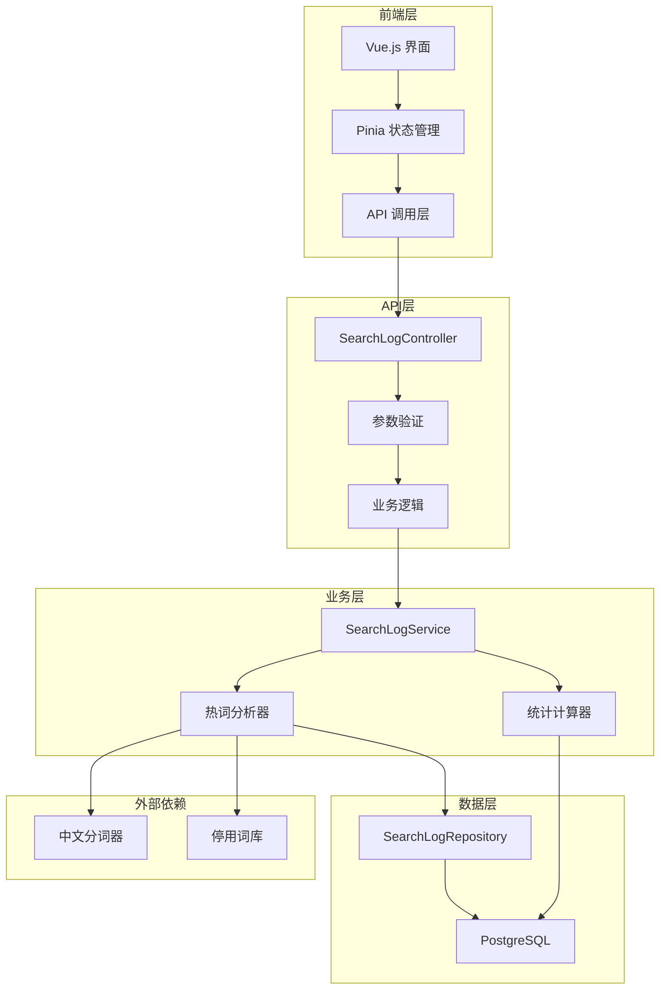

# 热词统计功能开发指南

## 概述

本文档为开发者提供热词统计功能的技术实现细节、架构设计、开发规范和扩展指南。热词统计模块是基于Spring Boot和Vue.js构建的企业级搜索分析系统的重要组成部分。

## 系统架构

### 整体架构



### 技术栈

**后端技术栈**
- Spring Boot 3.2.1
- Java 17
- PostgreSQL 数据库
- Spring Data JPA
- Spring Security (JWT认证)
- Springdoc OpenAPI (API文档)

**前端技术栈**
- Vue.js 3.5.18
- TypeScript
- Pinia (状态管理)
- Reka UI + TailwindCSS
- ECharts (图表组件)

## 核心模块设计

### 1. 数据模型设计

#### 搜索日志实体 (SearchLog)

```java
@Entity
@Table(name = "search_logs", indexes = {
    @Index(name = "idx_search_logs_created_at", columnList = "created_at"),
    @Index(name = "idx_search_logs_user_id", columnList = "user_id"),
    @Index(name = "idx_search_logs_search_space_id", columnList = "search_space_id"),
    @Index(name = "idx_search_logs_query", columnList = "query")
})
public class SearchLog extends BaseEntity {

    @Column(name = "user_id", length = 50)
    private String userId;

    @Column(name = "search_space_id", length = 50)
    private String searchSpaceId;

    @Column(name = "query", columnDefinition = "TEXT")
    private String query;

    @Column(name = "response_time_ms")
    private Integer responseTimeMs;

    @Enumerated(EnumType.STRING)
    @Column(name = "status", length = 20)
    private SearchLogStatus status;

    // ... 其他字段
}
```

#### 热词响应DTO (HotWordResponse)

```java
@Data
@Builder
@Schema(description = "热词统计响应")
public class HotWordResponse {

    @Schema(description = "热词", example = "人工智能")
    private String word;

    @Schema(description = "出现次数", example = "150")
    private Long count;

    @Schema(description = "出现频率百分比", example = "15.5")
    private Double percentage;

    @Schema(description = "分词详情")
    private SegmentDetails segmentDetails;

    // 嵌套类定义...
}
```

### 2. 核心业务逻辑

#### SearchLogService 接口设计

```java
public interface SearchLogService {

    /**
     * 获取热词统计
     * @param request 热词查询请求
     * @return 热词列表
     */
    List<HotWordResponse> getHotWords(HotWordRequest request);

    /**
     * 获取搜索统计数据
     * @param request 统计查询请求
     * @return 统计结果
     */
    SearchLogStatistics getSearchStatistics(StatisticsRequest request);

    // 其他方法...
}
```

#### 热词分析算法实现

```java
@Component
public class HotWordAnalyzer {

    private final ChineseSegmenter segmenter;
    private final StopWordFilter stopWordFilter;

    /**
     * 分析搜索查询并提取热词
     */
    public List<WordFrequency> analyzeQueries(List<String> queries, HotWordRequest request) {
        Map<String, Long> wordCount = new HashMap<>();

        for (String query : queries) {
            List<String> words = segmentQuery(query, request);
            words.forEach(word -> wordCount.merge(word, 1L, Long::sum));
        }

        return wordCount.entrySet().stream()
                .map(entry -> WordFrequency.builder()
                        .word(entry.getKey())
                        .count(entry.getValue())
                        .build())
                .sorted((a, b) -> Long.compare(b.getCount(), a.getCount()))
                .limit(request.getLimit())
                .collect(Collectors.toList());
    }

    /**
     * 中文分词处理
     */
    private List<String> segmentQuery(String query, HotWordRequest request) {
        List<String> segments = segmenter.segment(query);

        return segments.stream()
                .filter(word -> word.length() >= request.getMinWordLength())
                .filter(word -> !request.getExcludeStopWords() || !stopWordFilter.isStopWord(word))
                .collect(Collectors.toList());
    }
}
```

### 3. 数据访问层

#### Repository 查询优化

```java
@Repository
public interface SearchLogRepository extends JpaRepository<SearchLog, Long> {

    /**
     * 查询指定时间范围内的搜索查询
     */
    @Query("""
        SELECT sl.query
        FROM SearchLog sl
        WHERE sl.createdAt BETWEEN :startTime AND :endTime
        AND (:userId IS NULL OR sl.userId = :userId)
        AND (:searchSpaceId IS NULL OR sl.searchSpaceId = :searchSpaceId)
        AND sl.status = 'SUCCESS'
        """)
    List<String> findQueriesInTimeRange(
            @Param("startTime") LocalDateTime startTime,
            @Param("endTime") LocalDateTime endTime,
            @Param("userId") String userId,
            @Param("searchSpaceId") String searchSpaceId);

    /**
     * 统计查询词频
     */
    @Query("""
        SELECT sl.query, COUNT(*) as count
        FROM SearchLog sl
        WHERE sl.createdAt BETWEEN :startTime AND :endTime
        GROUP BY sl.query
        ORDER BY count DESC
        """)
    List<Object[]> countQueriesByFrequency(
            @Param("startTime") LocalDateTime startTime,
            @Param("endTime") LocalDateTime endTime);
}
```

### 4. 控制器层设计

#### API 端点实现

```java
@RestController
@RequestMapping("/search-logs")
@Tag(name = "搜索日志管理", description = "搜索日志查询、统计和分析相关API")
public class SearchLogController {

    @GetMapping("/hot-words")
    @Operation(summary = "获取热词统计")
    public ResponseEntity<ApiResponse<List<HotWordResponse>>> getHotWords(
            @Parameter(description = "开始时间") @RequestParam(required = false)
            @DateTimeFormat(pattern = "yyyy-MM-dd HH:mm:ss") LocalDateTime startDate,
            // 其他参数...
            ) {

        try {
            // 参数验证
            validateHotWordRequest(startDate, endDate, limit, minWordLength);

            // 构建请求对象
            HotWordRequest request = HotWordRequest.builder()
                    .startDate(startDate)
                    .endDate(endDate)
                    .limit(limit)
                    // 其他字段...
                    .build();

            // 调用服务
            List<HotWordResponse> hotWords = searchLogService.getHotWords(request);

            return ResponseEntity.ok(ApiResponse.success(hotWords));

        } catch (Exception e) {
            log.error("获取热词统计失败", e);
            return ResponseEntity.internalServerError()
                    .body(ApiResponse.error("获取热词统计失败: " + e.getMessage()));
        }
    }

    private void validateHotWordRequest(LocalDateTime startDate, LocalDateTime endDate,
                                       Integer limit, Integer minWordLength) {
        if (limit != null && (limit <= 0 || limit > 100)) {
            throw new IllegalArgumentException("返回数量限制必须在1-100之间");
        }

        if (minWordLength != null && (minWordLength <= 0 || minWordLength > 20)) {
            throw new IllegalArgumentException("最小词长必须在1-20之间");
        }

        if (startDate != null && endDate != null && startDate.isAfter(endDate)) {
            throw new IllegalArgumentException("开始时间不能晚于结束时间");
        }
    }
}
```

## 前端实现

### 1. 状态管理 (Pinia Store)

```typescript
// stores/hotWordStore.ts
import { defineStore } from 'pinia'
import { ref, computed } from 'vue'
import type { HotWordRequest, HotWordResponse } from '@/types/search-log'

export const useHotWordStore = defineStore('hotWord', () => {
  // 状态
  const hotWords = ref<HotWordResponse[]>([])
  const loading = ref(false)
  const error = ref<string | null>(null)
  const filters = ref<HotWordRequest>({
    limit: 10,
    minWordLength: 2,
    excludeStopWords: true,
    includeSegmentDetails: false
  })

  // 计算属性
  const totalCount = computed(() =>
    hotWords.value.reduce((sum, word) => sum + word.count, 0)
  )

  const topWords = computed(() =>
    hotWords.value.slice(0, filters.value.limit)
  )

  // 动作
  const fetchHotWords = async (request?: Partial<HotWordRequest>) => {
    loading.value = true
    error.value = null

    try {
      const params = { ...filters.value, ...request }
      const response = await api.getHotWords(params)

      if (response.success) {
        hotWords.value = response.data
      } else {
        error.value = response.message
      }
    } catch (err) {
      error.value = '获取热词数据失败'
      console.error('获取热词失败:', err)
    } finally {
      loading.value = false
    }
  }

  const updateFilters = (newFilters: Partial<HotWordRequest>) => {
    filters.value = { ...filters.value, ...newFilters }
  }

  return {
    // 状态
    hotWords,
    loading,
    error,
    filters,
    // 计算属性
    totalCount,
    topWords,
    // 动作
    fetchHotWords,
    updateFilters
  }
})
```

### 2. API 调用层

```typescript
// api/searchLog.ts
import request from '@/utils/request'
import type {
  HotWordRequest,
  HotWordResponse,
  ApiResponse
} from '@/types/search-log'

export const searchLogApi = {
  /**
   * 获取热词统计
   */
  getHotWords(params: HotWordRequest): Promise<ApiResponse<HotWordResponse[]>> {
    return request.get('/search-logs/hot-words', { params })
  },

  /**
   * 获取搜索统计
   */
  getStatistics(params: StatisticsRequest): Promise<ApiResponse<SearchLogStatistics>> {
    return request.get('/search-logs/statistics', { params })
  },

  /**
   * 记录点击行为
   */
  recordClick(data: SearchClickRequest): Promise<ApiResponse<void>> {
    return request.post('/search-logs/click', data)
  }
}
```

### 3. 组件实现

```vue
<!-- components/HotWordChart.vue -->
<template>
  <div class="hot-word-chart">
    <div class="chart-header">
      <h3>热词统计</h3>
      <div class="chart-controls">
        <button
          v-for="view in viewTypes"
          :key="view.value"
          :class="{ active: currentView === view.value }"
          @click="currentView = view.value"
        >
          {{ view.label }}
        </button>
      </div>
    </div>

    <div class="chart-content">
      <!-- 列表视图 -->
      <div v-if="currentView === 'list'" class="word-list">
        <div
          v-for="(word, index) in hotWords"
          :key="word.word"
          class="word-item"
          @click="showWordDetail(word)"
        >
          <div class="word-rank">{{ index + 1 }}</div>
          <div class="word-info">
            <div class="word-text">{{ word.word }}</div>
            <div class="word-stats">
              <span class="count">{{ word.count }}次</span>
              <span class="percentage">{{ word.percentage }}%</span>
            </div>
          </div>
          <div class="word-trend">
            <TrendIcon :trend="word.trend" />
          </div>
        </div>
      </div>

      <!-- 词云视图 -->
      <div v-else-if="currentView === 'cloud'" class="word-cloud">
        <WordCloud :words="hotWords" @word-click="showWordDetail" />
      </div>

      <!-- 图表视图 -->
      <div v-else class="word-chart">
        <ECharts
          :option="chartOption"
          :style="{ width: '100%', height: '400px' }"
          @click="onChartClick"
        />
      </div>
    </div>

    <!-- 详情弹窗 -->
    <WordDetailModal
      v-model:visible="detailVisible"
      :word="selectedWord"
    />
  </div>
</template>

<script setup lang="ts">
import { ref, computed, onMounted } from 'vue'
import { useHotWordStore } from '@/stores/hotWordStore'
import type { HotWordResponse } from '@/types/search-log'

const hotWordStore = useHotWordStore()
const { hotWords, loading, fetchHotWords } = hotWordStore

const currentView = ref<'list' | 'cloud' | 'chart'>('list')
const detailVisible = ref(false)
const selectedWord = ref<HotWordResponse | null>(null)

const viewTypes = [
  { value: 'list', label: '列表' },
  { value: 'cloud', label: '词云' },
  { value: 'chart', label: '图表' }
]

// ECharts 配置
const chartOption = computed(() => ({
  tooltip: {
    trigger: 'item',
    formatter: '{b}: {c}次 ({d}%)'
  },
  series: [
    {
      type: 'pie',
      radius: ['40%', '70%'],
      data: hotWords.value.map(word => ({
        name: word.word,
        value: word.count
      }))
    }
  ]
}))

const showWordDetail = (word: HotWordResponse) => {
  selectedWord.value = word
  detailVisible.value = true
}

const onChartClick = (params: any) => {
  const word = hotWords.value.find(w => w.word === params.name)
  if (word) {
    showWordDetail(word)
  }
}

onMounted(() => {
  fetchHotWords()
})
</script>
```

## 性能优化

### 1. 数据库优化

#### 索引策略

```sql
-- 时间范围查询优化
CREATE INDEX idx_search_logs_created_at ON search_logs(created_at);

-- 复合索引优化多条件查询
CREATE INDEX idx_search_logs_composite ON search_logs(created_at, user_id, search_space_id);

-- 查询词的全文索引
CREATE INDEX idx_search_logs_query_gin ON search_logs USING gin(to_tsvector('chinese', query));
```

#### 查询优化

```java
// 分页查询优化
@Query("""
    SELECT new com.ynet.mgmt.searchlog.dto.HotWordSummary(
        sl.query, COUNT(*),
        MIN(sl.createdAt), MAX(sl.createdAt)
    )
    FROM SearchLog sl
    WHERE sl.createdAt BETWEEN :startTime AND :endTime
    GROUP BY sl.query
    HAVING COUNT(*) >= :minCount
    ORDER BY COUNT(*) DESC
    """)
Page<HotWordSummary> findHotWordsPaged(
    @Param("startTime") LocalDateTime startTime,
    @Param("endTime") LocalDateTime endTime,
    @Param("minCount") int minCount,
    Pageable pageable);
```

### 2. 缓存策略

#### Redis 缓存实现

```java
@Service
@Slf4j
public class HotWordCacheService {

    @Autowired
    private RedisTemplate<String, Object> redisTemplate;

    private static final String HOT_WORDS_KEY_PREFIX = "hot_words:";
    private static final Duration CACHE_TTL = Duration.ofMinutes(30);

    public List<HotWordResponse> getCachedHotWords(String cacheKey) {
        try {
            Object cached = redisTemplate.opsForValue().get(HOT_WORDS_KEY_PREFIX + cacheKey);
            if (cached != null) {
                return (List<HotWordResponse>) cached;
            }
        } catch (Exception e) {
            log.warn("获取缓存失败: {}", e.getMessage());
        }
        return null;
    }

    public void cacheHotWords(String cacheKey, List<HotWordResponse> hotWords) {
        try {
            redisTemplate.opsForValue().set(
                HOT_WORDS_KEY_PREFIX + cacheKey,
                hotWords,
                CACHE_TTL
            );
        } catch (Exception e) {
            log.warn("缓存写入失败: {}", e.getMessage());
        }
    }

    private String generateCacheKey(HotWordRequest request) {
        return String.format("%s_%s_%d_%s_%s",
            request.getStartDate(),
            request.getEndDate(),
            request.getLimit(),
            request.getUserId(),
            request.getSearchSpaceId()
        );
    }
}
```

### 3. 前端性能优化

#### 虚拟滚动实现

```vue
<!-- 大数据量列表优化 -->
<template>
  <div class="virtual-list" ref="containerRef">
    <div
      class="list-content"
      :style="{ height: totalHeight + 'px' }"
    >
      <div
        v-for="item in visibleItems"
        :key="item.index"
        class="list-item"
        :style="{
          transform: `translateY(${item.top}px)`,
          position: 'absolute',
          width: '100%'
        }"
      >
        <HotWordItem :word="item.data" />
      </div>
    </div>
  </div>
</template>

<script setup lang="ts">
import { ref, computed, onMounted, onUnmounted } from 'vue'

const props = defineProps<{
  items: HotWordResponse[]
  itemHeight: number
}>()

const containerRef = ref<HTMLElement>()
const scrollTop = ref(0)
const containerHeight = ref(400)

const totalHeight = computed(() => props.items.length * props.itemHeight)

const visibleItems = computed(() => {
  const start = Math.floor(scrollTop.value / props.itemHeight)
  const end = Math.min(
    start + Math.ceil(containerHeight.value / props.itemHeight) + 1,
    props.items.length
  )

  return props.items.slice(start, end).map((item, index) => ({
    index: start + index,
    data: item,
    top: (start + index) * props.itemHeight
  }))
})

const handleScroll = (e: Event) => {
  scrollTop.value = (e.target as HTMLElement).scrollTop
}

onMounted(() => {
  containerRef.value?.addEventListener('scroll', handleScroll)
})

onUnmounted(() => {
  containerRef.value?.removeEventListener('scroll', handleScroll)
})
</script>
```

## 扩展开发

### 1. 添加新的分析维度

#### 地理位置分析

```java
// 扩展SearchLog实体
@Entity
public class SearchLog extends BaseEntity {
    // 现有字段...

    @Column(name = "ip_location")
    private String ipLocation;

    @Column(name = "city")
    private String city;

    @Column(name = "region")
    private String region;
}

// 新增地理位置热词分析
@Service
public class GeoHotWordService {

    public List<GeoHotWordResponse> getGeoHotWords(GeoHotWordRequest request) {
        // 按地理位置聚合热词统计
    }
}
```

#### 时间段分析

```java
// 按小时统计热词
public Map<Integer, List<HotWordResponse>> getHourlyHotWords(HotWordRequest request) {
    Map<Integer, List<String>> hourlyQueries = searchLogRepository
        .findQueriesGroupByHour(request.getStartDate(), request.getEndDate());

    return hourlyQueries.entrySet().stream()
        .collect(Collectors.toMap(
            Map.Entry::getKey,
            entry -> analyzeHotWords(entry.getValue(), request)
        ));
}
```

### 2. 集成外部分词服务

#### HanLP 分词器集成

```java
@Component
public class HanLPSegmenter implements ChineseSegmenter {

    private final HanLP hanLP;

    @PostConstruct
    public void init() {
        // 初始化HanLP
        this.hanLP = HanLP.newSegment()
                .enableNameRecognize(true)
                .enablePlaceRecognize(true);
    }

    @Override
    public List<String> segment(String text) {
        return hanLP.seg(text).stream()
                .map(term -> term.word)
                .filter(word -> word.length() > 1)
                .collect(Collectors.toList());
    }

    @Override
    public List<SegmentResult> segmentWithPos(String text) {
        return hanLP.seg(text).stream()
                .map(term -> SegmentResult.builder()
                        .word(term.word)
                        .partOfSpeech(term.nature.toString())
                        .build())
                .collect(Collectors.toList());
    }
}
```

### 3. 实时热词推送

#### WebSocket 实现

```java
@Controller
public class HotWordWebSocketController {

    @Autowired
    private SimpMessagingTemplate messagingTemplate;

    @EventListener
    public void handleHotWordUpdate(HotWordUpdateEvent event) {
        // 推送热词更新到客户端
        messagingTemplate.convertAndSend("/topic/hot-words", event.getHotWords());
    }
}
```

```typescript
// 前端WebSocket监听
import { useWebSocket } from '@/composables/useWebSocket'

export const useHotWordRealtime = () => {
  const { connect, disconnect, subscribe } = useWebSocket()

  const startRealtimeUpdates = () => {
    connect()
    subscribe('/topic/hot-words', (data) => {
      // 更新热词数据
      hotWordStore.updateHotWords(data)
    })
  }

  const stopRealtimeUpdates = () => {
    disconnect()
  }

  return {
    startRealtimeUpdates,
    stopRealtimeUpdates
  }
}
```

## 测试策略

### 1. 单元测试

```java
@ExtendWith(MockitoExtension.class)
class HotWordAnalyzerTest {

    @Mock
    private ChineseSegmenter segmenter;

    @Mock
    private StopWordFilter stopWordFilter;

    @InjectMocks
    private HotWordAnalyzer analyzer;

    @Test
    void should_extract_hot_words_correctly() {
        // Given
        List<String> queries = Arrays.asList(
            "人工智能发展趋势",
            "机器学习算法",
            "人工智能应用"
        );

        when(segmenter.segment(anyString()))
            .thenReturn(Arrays.asList("人工智能", "发展", "趋势"));

        when(stopWordFilter.isStopWord(anyString()))
            .thenReturn(false);

        HotWordRequest request = HotWordRequest.builder()
            .limit(10)
            .minWordLength(2)
            .excludeStopWords(true)
            .build();

        // When
        List<WordFrequency> result = analyzer.analyzeQueries(queries, request);

        // Then
        assertThat(result).hasSize(3);
        assertThat(result.get(0).getWord()).isEqualTo("人工智能");
        assertThat(result.get(0).getCount()).isEqualTo(2);
    }
}
```

### 2. 集成测试

```java
@SpringBootTest
@TestPropertySource(locations = "classpath:application-test.yml")
class SearchLogControllerIntegrationTest {

    @Autowired
    private TestRestTemplate restTemplate;

    @Autowired
    private SearchLogRepository searchLogRepository;

    @Test
    void should_return_hot_words_successfully() {
        // Given
        createTestData();

        String url = "/api/search-logs/hot-words?limit=5&minWordLength=2";

        // When
        ResponseEntity<ApiResponse<List<HotWordResponse>>> response =
            restTemplate.exchange(url, HttpMethod.GET, null,
                new ParameterizedTypeReference<>() {});

        // Then
        assertThat(response.getStatusCode()).isEqualTo(HttpStatus.OK);
        assertThat(response.getBody().isSuccess()).isTrue();
        assertThat(response.getBody().getData()).hasSize(5);
    }

    private void createTestData() {
        // 创建测试搜索日志数据
        IntStream.range(0, 100).forEach(i -> {
            SearchLog log = SearchLog.builder()
                .userId("user" + (i % 10))
                .query("测试查询" + (i % 20))
                .status(SearchLogStatus.SUCCESS)
                .responseTimeMs(100 + i)
                .build();
            searchLogRepository.save(log);
        });
    }
}
```

### 3. 前端测试

```typescript
// vitest 测试
import { describe, it, expect, vi } from 'vitest'
import { mount } from '@vue/test-utils'
import { createPinia } from 'pinia'
import HotWordChart from '@/components/HotWordChart.vue'

describe('HotWordChart', () => {
  it('should display hot words correctly', async () => {
    const pinia = createPinia()
    const wrapper = mount(HotWordChart, {
      global: {
        plugins: [pinia]
      }
    })

    // Mock 数据
    const mockHotWords = [
      { word: '人工智能', count: 100, percentage: 20.0 },
      { word: '机器学习', count: 80, percentage: 16.0 }
    ]

    // 设置store数据
    const hotWordStore = useHotWordStore()
    hotWordStore.hotWords = mockHotWords

    await wrapper.vm.$nextTick()

    // 验证渲染
    expect(wrapper.find('.word-item').exists()).toBe(true)
    expect(wrapper.text()).toContain('人工智能')
    expect(wrapper.text()).toContain('100次')
  })
})
```

## 部署和监控

### 1. Docker 部署配置

```dockerfile
# backend/Dockerfile
FROM openjdk:17-jdk-slim

WORKDIR /app

COPY target/mgmt-backend.jar app.jar

# 添加中文字体支持
RUN apt-get update && apt-get install -y fonts-noto-cjk

# JVM 优化参数
ENV JAVA_OPTS="-Xms512m -Xmx2g -XX:+UseG1GC -XX:MaxGCPauseMillis=200"

EXPOSE 8080

CMD ["sh", "-c", "java $JAVA_OPTS -jar app.jar"]
```

### 2. 性能监控

```java
@Component
public class HotWordMetrics {

    private final MeterRegistry meterRegistry;
    private final Counter hotWordRequestCounter;
    private final Timer hotWordAnalysisTimer;

    public HotWordMetrics(MeterRegistry meterRegistry) {
        this.meterRegistry = meterRegistry;
        this.hotWordRequestCounter = Counter.builder("hot_word_requests_total")
                .description("Total hot word requests")
                .register(meterRegistry);

        this.hotWordAnalysisTimer = Timer.builder("hot_word_analysis_duration")
                .description("Hot word analysis duration")
                .register(meterRegistry);
    }

    public void recordRequest() {
        hotWordRequestCounter.increment();
    }

    public void recordAnalysisDuration(Duration duration) {
        hotWordAnalysisTimer.record(duration);
    }
}
```

## 故障排除

### 常见问题及解决方案

1. **内存溢出问题**
   - 调整JVM内存参数
   - 优化查询分页大小
   - 增加缓存策略

2. **查询性能慢**
   - 检查数据库索引
   - 优化查询条件
   - 考虑异步处理

3. **分词准确性低**
   - 更新分词词典
   - 调整停用词库
   - 优化分词算法

## 最佳实践

1. **代码规范**
   - 遵循阿里巴巴Java开发规范
   - 使用ESLint和Prettier格式化前端代码
   - 编写完整的单元测试

2. **性能优化**
   - 合理使用缓存
   - 数据库查询优化
   - 前端虚拟化渲染

3. **安全考虑**
   - 参数验证和过滤
   - SQL注入防护
   - 敏感数据脱敏

4. **可维护性**
   - 模块化设计
   - 完善的文档
   - 监控和日志

## 更新日志

### v1.0.0 (2024-01-07)
- 初始版本发布
- 基础热词统计功能
- API文档和开发指南